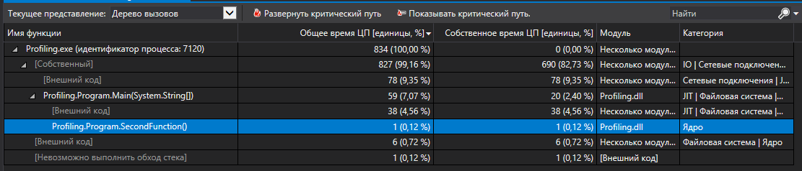

# Профілювання прjграм

У коді присутня функція `sleep`. Поки основний потік знаходився у сплячому режимі, то просецор був звільнений і виконував інші задачі. 

При профілюванні, було виявлено, що багато часу (не процесорного часу) займає функція sleep.
